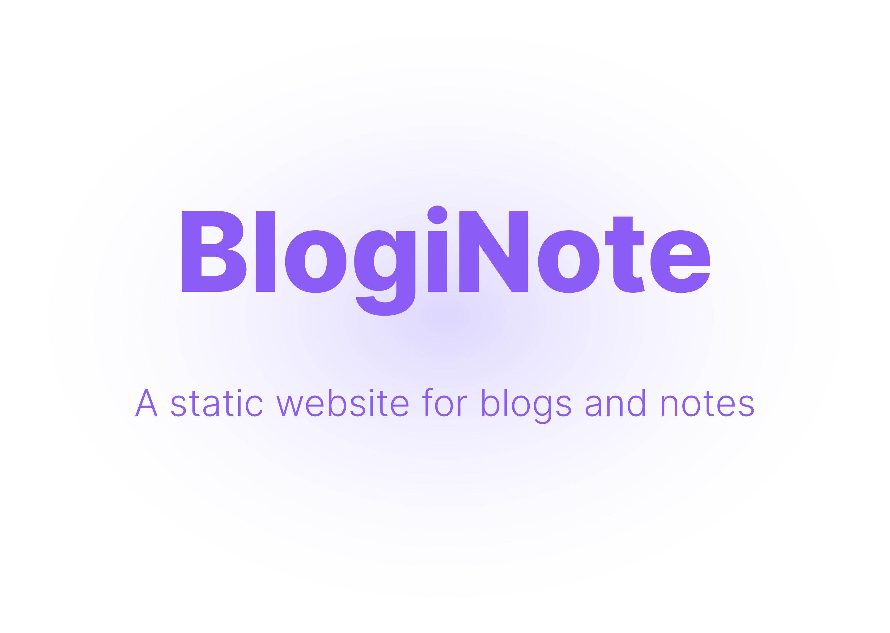

# BlogiNote Documentation
BlogiNote is a [Nuxt Theme](https://nuxt.com/docs/guide/going-further/layers) based on [Nuxt Content module](https://content.nuxtjs.org/), it can generate static website to show your blog posts and notes with flexible layouts and multiple optimizations.

This is the repo of the documentation of BlogiNote.

If you want to try BlogiNote, click the following links:

:link: [Demo](https://bloginote.benbinbin.com/)

:joystick: [Play Online](https://stackblitz.com/edit/github-qrmhoj)

:pencil: [Starter Template](https://github.com/Benbinbin/BlogiNote-Starter-Template)

:bookmark_tabs: [Documentation](https://blogi-note-documentation.vercel.app/)

:package: [Github Repo](https://github.com/Benbinbin/BlogiNote)

## License

[MIT](./LICENSE)

## Feedback
If you have any problem or suggestion about this project, feel free to open an [issue](https://github.com/Benbinbin/BlogiNote/issues/new) in Github or contact with me by email <a href="mailto:benthomsonbin@gmail.com">benthomsonbin@gmail.com</a>