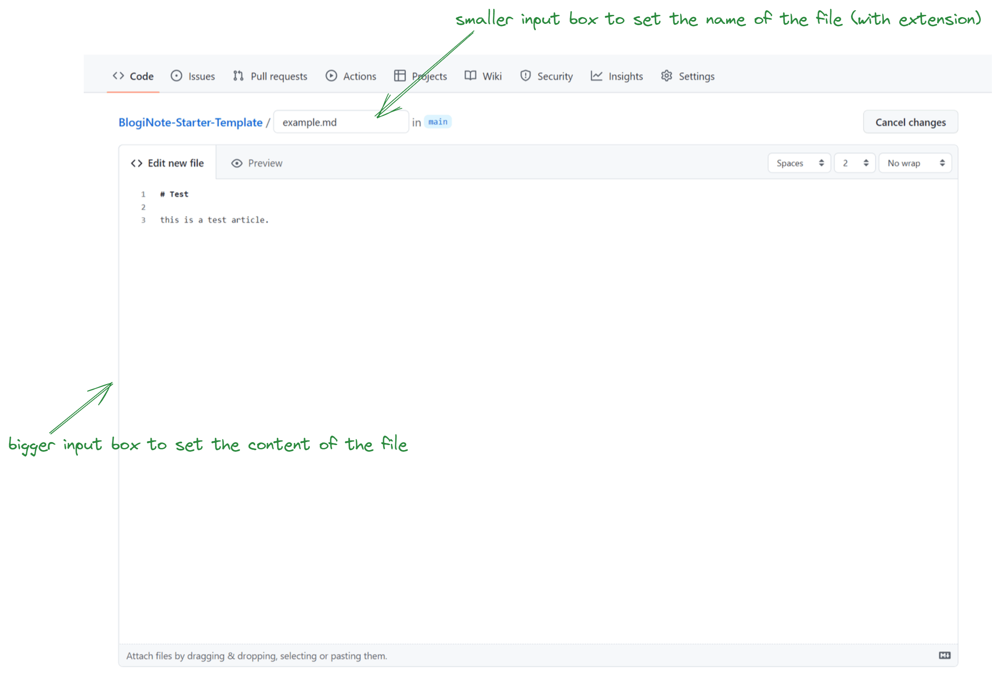
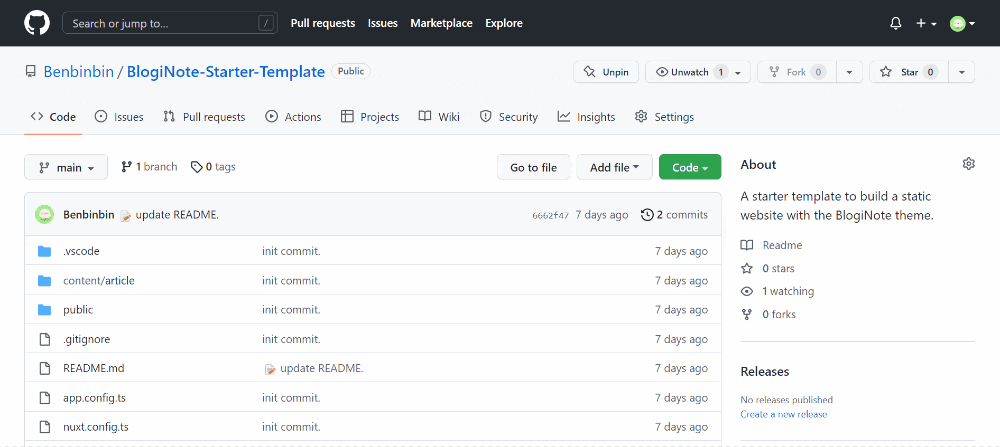

# 着手开始

这篇教程会一步一步地向你介绍如何创建一个项目。

:IconCustom{name="ph:lightning-fill" iconClass="text-yellow-400"} 让我们开始吧 :IconCustom{name="ph:lightning-fill" iconClass="text-yellow-400"}

## 构建开发环境（可选）

::TipBox{type="announce" name="可选步骤"}
这部分的步骤是**可选的**。

如果你只需要在本地写写 markdown 文件（然后上传到远端的 Github 仓库），那么你可以**跳过**该部分。

如果你想在本地测试或预览从 markdown 文件解析生成的网页，那么你需要按照以下步骤操作。
::

1. 首先安装 Node.js：

    你可以在 Node.js [官网](https://nodejs.org/en/download/)里下载最新的 LTS 版本的安装器（请选择适合你操作系统的安装器），并安装它。

    ::TipBox{type="good" name="推荐"}
    对于开发者更友好的安装 Node.js 方式是使用 **[nvm](https://github.com/nvm-sh/nvm)**。

    nvm 能够管理多个 Node.js 版本并可以十分方便地切换它们。

    nvm 支持 UNIX，Mac 和 Windows WSL 系统。你可以在 Windows 系统中尝试 **[nvm-windows](https://github.com/coreybutler/nvm-windows)**。
    ::

2. 然后在终端里执行以下命令以在全局环境里安装 [`yarn` 包](https://yarnpkg.com/)：

    ```bash
    npm i yarn
    ```

3. 安装 [Git](https://git-scm.com/downloads)：

    Git 是一个免费开源的版本控管系统，我们将使用它去控管文章内容的版本，并在本地项目和远端 Github 仓库之间同步这些更改。

    ::TipBox{type="tip" name="版本控管"}
    版本控管 Version Control 是一个有关软件开发的概念。

    在一个软件的开发过程中，代码会多次更改。

    每当新增功能或修复漏洞后，开发者就会发布新的版本以标记新的更改。
    ::

4. 安装 [Visual Studio Code](https://code.visualstudio.com/)：

    Visual Studio Code 是一个开源的编辑器，它为开发者提供很多有用的功能和插件。

    ::TipBox{type="tip" name="提示"}
    如果你只是想写写 markdown 文件（作为文章），并不需要编写代码对项目功能进行定制，那么你可以安装其他任何一款你喜欢的 [Markdown 编辑器](https://github.com/mundimark/awesome-markdown-editors)。

    :sparkles: 如果你不想额外安装任何一款编辑器在电脑上，你可以尝试这个 [StackBlitz](https://stackblitz.com/edit/github-qrmhoj) 项目。

    这是一个运行着 BlogiNote 的免费在线编程环境，它开箱即用 :sunglasses: 你可以在里面创建任何数量的 markdown 文件，并在右侧的预览窗口实时看到更新结果。
    ::

## 注册 Github 和 Vercel 账号

1. 首先注册一个 [Github](https://github.com/) 账号：

    ::TipBox{type="tip"}
    Github 是一个在线代码托管平台。

    [BlogiNote 的源代码](https://github.com/Benbinbin/BlogiNote)也是托管在该平台上。
    ::

    你需要在 Github 注册一个账号，因为下一步需要从该平台克隆一个初始化模板。

    :IconCustom{name="noto:money-bag" iconClass="w-6 h-6"} Github [免费计划 Free Plan](https://github.com/settings/billing/plans) 的额度对于该项目是足够的。

2. 然后注册一个 [Vercel](https://vercel.com) 账号：

    我们需要将静态网站部署到该平台。

    :IconCustom{name="noto:money-bag" iconClass="w-6 h-6"} Vercel [免费计划 Free/Hobby Plan](https://vercel.com/pricing) 的额度对于该项目是足够的。如果你之后需要为网站增加更多的带宽，可以在任何时候升级计划。

    ::TipBox{type="good" name="推荐"}
    更方便的方式是直接登录 **Login** 并选择 [:IconCustom{name="octicon:mark-github-16" iconClass="w-4 h-4"} Continue with Github]{.w-fit .px-4 .py-1 .inline-flex .items-center .gap-2 .text-sm .text-white .font-bold .bg-gray-800 .hover:bg-gray-600 .rounded .transition-colors .duration-300 .cursor-pointer} 选项。
    ::

## 使用初始化模板

构建你自己的项目的最简单的方式是使用 BlogiNote 的初始化模板。

::TipBox{type="warning" name="注意"}
你需要在执行下一步操作前，先注册一个 Github 账号并登录。

请查看上一部分 *[注册 Github 和 Vercel 账号](#注册-github-和-vercel-账号)* 以了解如何注册 Github 账号。
::

### 克隆模板
打开[该网页](https://github.com/Benbinbin/BlogiNote-Starter-Template)，并点击页面右上角的 [:IconCustom{name="octicon:repo-forked-24" iconClass="w-4 h-4"} Fork]{.w-fit .px-2 .py-1 .inline-flex .items-center .gap-2 .text-xs .text-gray-600 .hover:bg-gray-100 .border .border-gray-300 .rounded .transition-colors .duration-300 .cursor-pointer} 按钮。

然后就会在你的 Github 账号下创建了一个该模板的副本。

现在你对于这个副本仓库有完全的控制权，例如可以点击 [:IconCustom{name="octicon:settings-24" iconClass="w-4 h-4"} Settings]{.w-fit .px-2 .py-1 .inline-flex .items-center .gap-2 .text-xs .text-gray-600 .hover:bg-gray-100 .border .border-gray-300 .rounded .transition-colors .duration-300 .cursor-pointer} 标签，并在 `Repository name` 输入框中重命名该仓库的名称。

### 下载模板（可选）

::TipBox{type="announce" name="可选步骤"}
这部分的步骤是**可选的**。

如果你只需要在本地写写 markdown 文件（然后上传到远端的 Github 仓库），那么你可以**跳过**该部分。

如果你想在本地测试或预览从 markdown 文件解析生成的网页，那么你需要按照以下步骤操作。
::

::TipBox{type="warning" name="注意"}
你需要在执行下一步操作前，先在电脑上安装好 VS Code 软件，因为之后的步骤需要在该软件内执行。

请查看上一部分 *[构建开发环境](#构建开发环境可选) 第 4 步* 以获取更多信息。
::

使用 VS Code 打开你（在上一步）所下载的文件夹。

因为该项目是基于 Nuxt 3 开发的，所以你需要先按照 [Nuxt 文档](https://v3.nuxtjs.org/getting-started/installation#prerequisites)所述的步骤去配置好 VS Code 环境：

* 安装 VS Code 插件 [Volar](https://marketplace.visualstudio.com/items?itemName=vue.volar)

* 启用 [Take Over Mode](https://github.com/johnsoncodehk/volar/discussions/471)：

    1. 确保 Volar 版本更新到高于 -.27.17
    2. 禁用软件内置的 TypeScript 插件：

        * 使用快捷键 `Shift` + `Ctrl` + `P` 打开 VS Code 的命令面板
        * 输入并执行 `Extensions: Show Built-in Extensions` 命令，以打开插件列表侧栏
        * 找到 `TypeScript and JavaScript Language Features` 插件，并右击选择 `禁用(工作区)` 选项
    3. 重启 VS Code

* 在 `nuxt.config.ts` 文件中添加以下的代码，以禁止为 `*.vue` 文件生成 shim 文件

    ```ts [nuxt.config.ts] {2-4}
    export default defineNuxtConfig({
      typescript: {
        shim: false
      }
    })
    ```

::TipBox{type="tip" name="提示"}
BlogiNote 支持使用 Tailwind CSS 来设置页面的外观，你可以在 VS Code 中安装相应的拓展 [Tailwind CSS IntelliSense](https://marketplace.visualstudio.com/items?itemName=bradlc.vscode-tailwindcss)。
::

然后使用快捷键 `Ctrl` + `~` 打开终端面板，并执行以下命令以安装项目的依赖包

```bash
yarn install
```

::TipBox{type="warning" name="注意"}
你需要在执行命令前，先在全局环境中安装 yarn 包。

请查看之前的部分 *[构建开发环境](#构建开发环境可选) 第 2 步* 以获取更多信息。
::

在安装好依赖包后，在终端执行以下命令以在本地启动一个服务器

```bash
yarn dev -o
```

然后在浏览器中会自动新开一个标签页并访问 `http://localhost:3000`

::TipBox{type="tip" name="提示"}
终端会输出本地服务器的地址 `>Local: http://localhost:3000`

服务器默认监听的端口是 `3000`，如果该端口已经被使用，则服务器引擎会自动监听另一个端口。

如果浏览器没有自动新开一个标签页访问本地服务器，你可以**按住 `Ctrl` 键再点击终端输出的地址**来打开它。

终端一般还会输出另一个地址 `Network: http://192.168.0.114:3000/` 你可以用连接到同一个局域网的其他设备访问该地址。
::

## 写文章
在 :file_folder: `content/article` 文件夹中创建任何数量的 markdown 文件来开始写文章。

::TipBox{type="tip" name="提示"}
如果你想深入了解更多关于如何写文章的细节，可以查看另一个教程[写一篇文章](./write-article-cn)
::

## 上传或同步更改

在你写完新文章或更改完文章后，你应该将它们从本地上传或同步到远端的 Github 仓库中。

有多种方法提交更改 commit changes，在这个教程中向你介绍两种方法：

* **通过 Github 网页提交更改**：该网页开箱即用，你只需要打开仓库的网页然后把需要上传的文件拖拽上传即可

* **通过 VS Code 提交更改**：VS Code 编辑器提供了优化的图形界面与 Git 配合工作，可以很方便地将更改从本地上传或同步到远端的 Github 仓库中。

### 在 Github 网页中提交更改
如果你在电脑上没有[配置好开发环境](#构建开发环境可选)，那么你可以选择通过 Github 仓库页面来上传文章（markdown 文件）。

点击仓库页面的 [Add file :IconCustom{name="material-symbols:arrow-drop-down" iconClass="w-4 h-4"}]{.w-fit .px-2.5 .py-1.5 .inline-flex .items-center .gap-2 .text-sm .text-white .font-bold .bg-green-500 .hover:bg-green-600 .rounded .transition-colors .duration-300 .cursor-pointer} 按钮，然后你会在弹出菜单里看到两个选项 `Create new file` 和 `Upload files`，按需要选择其中之一。

然后就会跳转到另一个页面：

* 如果你选择了 `Create new file`

    你会在新页面里看到两个输入框，较小的输入框是用于设置新建文件的名称的（包含文件的拓展名），较大的输入框是用于填写文件的内容的

    

    ::TipBox{type="tip" name="提示"}
    你可以点击 [:IconCustom{name="octicon:eye-24" iconClass="w-4 h-4"} Preview]{.w-fit .p-1 .inline-flex .items-center .gap-2 .text-xs .text-gray-600 .bg-gray-50 .hover:bg-gray-100 .border .border-gray-300 .rounded .transition-colors .duration-300 .cursor-pointer} 标签来预览 markdown 文件渲染的结果。
    ::

* 如果你选择了 `Upload files`

    你会在新页面里看到一个上传框。

    点击这个框就会打开一个窗口，从中选择上传的本地文件或整个文件夹。

    你也可以将需要上传的文件或整个文件夹直接拖拽到上传框中。

    

::TipBox{type="tip" name="提示"}
你应该将 markdown 文件上传到 :file_folder: `content/article` 文件夹中。

所以首先需要在仓库页面中依次点击 :file_folder: `content` -> :file_folder: `article` 将路径切换到 :file_folder: `content/article` 文件夹下。

然后再点击 [Add file :IconCustom{name="material-symbols:arrow-drop-down" iconClass="w-4 h-4"}]{.w-fit .px-2.5 .py-1.5 .inline-flex .items-center .gap-2 .text-sm .text-white .font-bold .bg-green-500 .hover:bg-green-600 .rounded .transition-colors .duration-300 .cursor-pointer} 按钮来创建或上传文件。

如果你希望在一个名为  :file_folder: `tutorial` 新文件夹（该文件夹一开始并没有在 :file_folder: `content/article/` 文件夹内）中创建一个名为 `test.md` 的新文件，

首先你需要**在较小的输入框中键入 `tutorial` 再按下 `/` 斜线**，然后就会看到 `tutorial` 添加到了路径中，然后再在较小的输入框中键入 `test.md`，并在较大的输入框中输入文件的内容。


::

在页面的底部，有一个 **`Commit changes` 对话框**，你应该为当前这一次所提交的更改写下标题和描述，然后再点击 [Commit changes]{.w-fit .px-2.5 .py-1.5 .inline-flex .items-center .gap-2 .text-sm .text-white .font-bold .bg-green-500 .hover:bg-green-600 .rounded .transition-colors .duration-300 .cursor-pointer} 按钮将更改上传到 Github。


### 使用 VS Code 提交更改
如果你已经配置到开发环境，那么你可以使用 VS Code 提交更改到 Github 的远端仓库。

VS Code 提供了一个侧边栏用以将更改提交到 Github 仓库，这是一个图形界面可以通过点击几个按钮就完成操作，十分方便。

::TipBox{type="warning" name="注意"}
如果你想使用 VS Code 提交更改，你需要先在电脑上安装 VS Code 软件。

请查看之前的部分 *[构建开发环境](#构建开发环境可选) 第 4 步* 以获取更多信息。
::

::TipBox{type="tip" name="提示"}
你可以查看 [VS Code 的文档](https://code.visualstudio.com/docs/sourcecontrol/overview) 以获取更多关于如何使用 Git 的信息。
::

## 部署到 vercel

::TipBox{type="warning" name="注意"}
你需要先注册一个 Vercel 账号并登录，再执行下一步。

请查看之前的部分 *[注册 Github 和 Vercel 账号](#注册-github-和-vercel-账号)* 以获取更多信息。
::

点击 Vercel 网页右上角 [Add New... :IconCustom{name="ic:round-keyboard-arrow-down" iconClass="w- 4 h-4"}]{.w-fit .px-2.5 .py-1.5 .inline-flex .items-center .gap-4 .text-sm .text-white .hover:text-gray-800 .bg-gray-800 .hover:bg-white .border .border-gray-800 .rounded .transition-colors .duration-300 .cursor-pointer} 按钮，并在下拉菜单中选择 [Project]{.px-4 .py-1.5 .text-sm .text-gray-800 .bg-gray-200 .hover:bg-gray-300 .rounded .transition-colors .duration-300 .cursor-pointer} 选项。

接着跳转到一个新页面，点击页面的 [:IconCustom{name="octicon:mark-github-16" iconClass="w-4 h-4"} Continue with Github]{.w-fit .px-4 .py-1 .inline-flex .items-center .gap-2 .text-sm .text-white .bg-gray-800 .hover:bg-gray-600 .rounded .transition-colors .duration-300 .cursor-pointer} 选项，然后就会显示 **Import Git Repository** 组件。

在输入框 [:IconCustom{name="material-symbols:search-rounded" iconClass="w-4 h-4"} Search...]{.w-fit .pl-2 .pr-8 .py-1 .inline-flex .items-center .gap-2 .text-xs .text-gray-400 .border .border-gray-400 .rounded .cursor-text} 中键入 Github 仓库的名称进行搜索，并点击配对仓库的 [Import]{.px-2 .py-1 .text-sm .text-white .hover:text-blue-500 .bg-blue-500 .hover:bg-white .border .border-blue-500 .rounded .transition-colors .duration-300 .cursor-pointer} 按钮。

::TipBox{type="tip" name="提示"}
如果页面显示 **No Results Found**，则需要先点击 [:IconCustom{name="octicon:mark-github-16" iconClass="w-4 h-4"} Configure Github App]{.w-fit .px-4 .py-1 .inline-flex .items-center .gap-2 .text-sm .text-white .bg-gray-800 .hover:bg-gray-600 .rounded .transition-colors .duration-300 .cursor-pointer} 按钮对 Github 进行配置，然后再根据 Github 上的提示操作，让 Vercel 有权限可以访问相应的仓库。
::

将 Github 仓库导入到 Vercel 之后，会跳转到另一个页面进行 **项目配置 Configure Project**。在这个页面里你只需要进行一项配置。点击 [:IconCustom{name="ic:round-keyboard-arrow-right" iconClass="w-4 h-4"} Build and Output Settings]{.p-2 .text-xs .text-gray-400 .border} 按钮展开一个次级菜单项。

在这个次级菜单项里，你需要先点击在 **Build Command** 选项下的切换按钮 :IconCustom{name="fad:roundswitch-off" iconClass="w-4 h-4"}，然后就可以在旁边的输入框中键入代码 `yarn generate`

最后你所需要做的只是点击菜单下方的 [Deploy]{.px-6 .py-1 .text-sm .text-white .hover:text-blue-500 .bg-blue-500 .hover:bg-white .border .border-blue-500 .rounded .transition-colors .duration-300 .cursor-pointer} 按钮即可。

余下的繁琐工作都会在 Vercel 后台自动执行，包括运行 BlogiNote 解析 markdown 文件生成网页，并将它们部署到在线服务器上。

这些步骤将会在几分钟内完成（构建所花费的时间基于仓库中所包含的内容多少），最后会获得一个链接来访问你的项目。

::TipBox{type="tip" name="提示"}
你可以为项目网站配置[自定义的域名](https://vercel.com/docs/concepts/projects/domains/add-a-domain)。
::

:tada: 快点击链接访问你的网站吧！

::TipBox{type="tip" name="提示"}
在第一次部署后，Vercel 平台会监听你的 Github 仓库。每当你将更改提交到 Github 仓库，Vercel 就会自动重新部署。

也就是说，在你每一次提交新文章到 Github 仓库后，只需要等待几分钟再刷新网页就可以看到新的文章。

是的 :IconCustom{name="twemoji:partying-face"} 就是这么简单
::