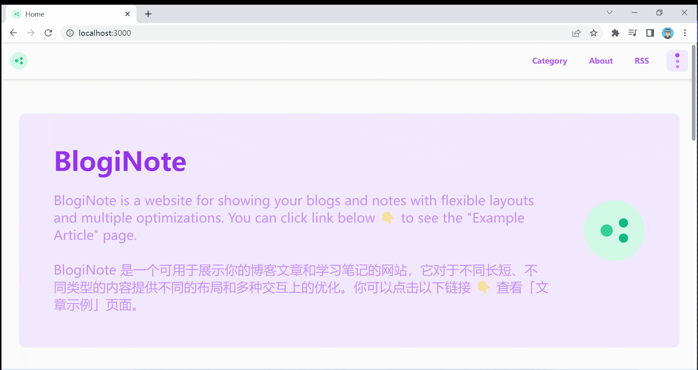
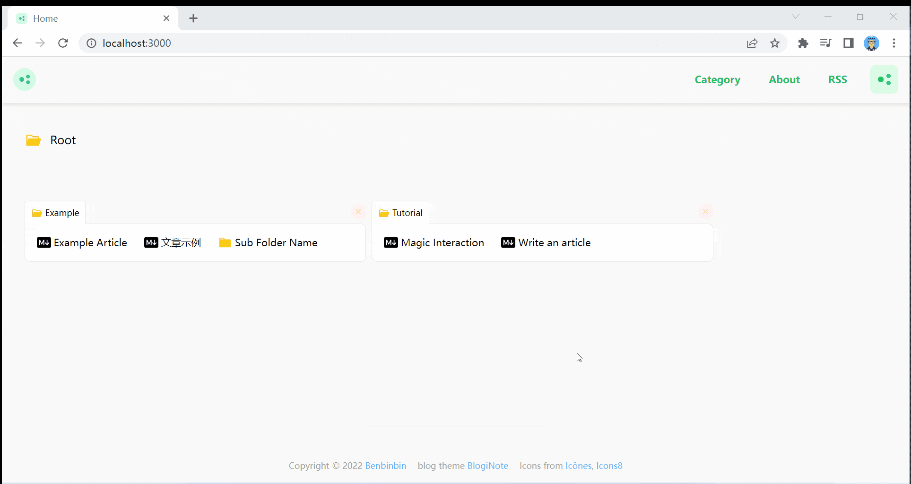

# Magic Interaction

This article show some magic interaction about BlogiNote.

## Change Mode
You can **switch the Mode** of the homepage between 'list' mode and 'folder' mode, just [:IconCustom{name="majesticons:cursor-click"} click]{.text-purple-500} the button at the top-right corner (or bottom-right corner in mobile view)

If you switch the mode to **'list' mode**, the page will show you some articles a list layout.

If you switch the mode to the **'note' mode**, the page will show all articles within a directory system in a grid layout, you can browser your notes like what you usually do in your PC.



And in the 'note' mode, you can [:IconCustom{name="majesticons:cursor-click"} click]{.text-purple-500} the sub-folder to drive down in place.



:IconCustom{name="noto:magic-wand"} Magic~Hum :v: feel free to play around the directory layout :yum:

## Code block

**Toggle** the :IconCustom{name="material-symbols:keyboard-arrow-down-rounded"} button on the left corner of the code block to change the :page_with_curl: long~long code block state between collapsing and expanding.

**Copy** the entire code block by [:IconCustom{name="majesticons:cursor-click"} one click]{.text-purple-500} the :IconCustom{name="uil:copy"} button

```js
const languageColorMap = {
  theme: '#a855f7',
  bash: '#89e051',
  shell: '#89e051',
  html: '#e34c26',
  javascript: '#f1e05a',
}
```

## Tip Boxes
[:IconCustom{name="majesticons:cursor-click"} Click]{.text-purple-500} on the icon or title at the top left corner of a TipBox to **expand or collapse** the content.

::TipBox{type="tip"}
Clicking on the icon or title above :point_up: will expand or collapse this section
::

## Image


You can [:IconCustom{name="ic:round-ads-click"} double click]{.text-purple-500} the image in the article, then a component called LightBox will pop up, it will enlarge the image as big as the screen.

You can interact with the LightBox:

* [:IconCustom{name="iconoir:mouse-scroll-wheel"} scroll]{.text-purple-500} the mouse wheel, or [:IconCustom{name="material-symbols:pinch-outline-rounded"} pinch]{.text-purple-500} (in the touch screen) on the image to zoom in or zoom out the image

* [:IconCustom{name="tabler:arrows-move"}drag]{.text-purple-500} to move the image around

* there're some buttons flow above the image, you can [:IconCustom{name="majesticons:cursor-click"} click]{.text-purple-500} the image to show or hide these buttons.

* if you want to close the LightBox, you can [:IconCustom{name="majesticons:cursor-click"} click]{.text-purple-500} the blur background, or [:IconCustom{name="majesticons:cursor-click"} click]{.text-purple-500} the [Esc :IconCustom{name="ic:round-close"}]{.p-1 .text-sm .text-red-500 .bg-red-100 .border .border-red-300 .rounded} button on the top-right corner, or just press the `Esc` shortcut key in your keyboard

* the purple [percent%]{.p-1 .text-sm .text-purple-500 .bg-purple-100 .border .border-purple-300 .rounded} button on the top-left corner show the current scale value of the image, you can [:IconCustom{name="majesticons:cursor-click"} click]{.text-purple-500} it, or just [:IconCustom{name="ic:round-ads-click"} double click]{.text-purple-500} the image to reset the scale (to 100%) and position (to center)