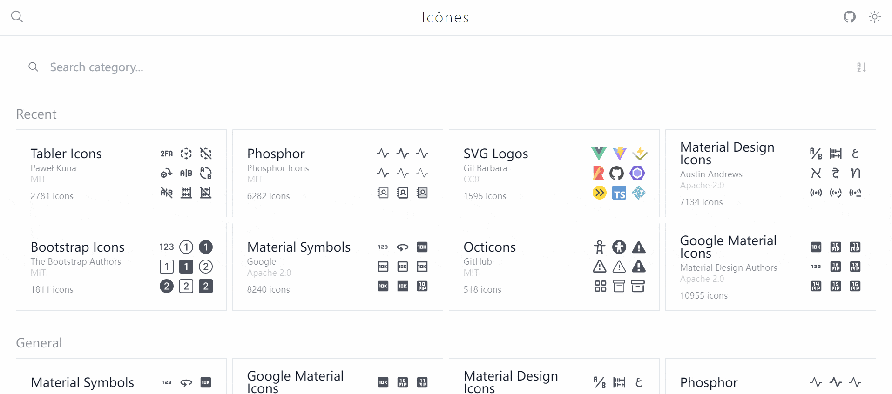

# MDC

MDC stand for MarkDown Components extended syntax, it expand the edge of the ability of Markdown by embedding the Vue components.

There are two types of MDC:

* **Inline MDC**: it starts with `:` identifier and the name of the MDC should be followed after it. The Inline MDC cannot contain any content.

* **Block MDC**: it's wrapped with the `::` identifier, and the name of the MDC should be followed after the first `::` identifier. The Block MDC can contain some content between the `::` identifier.

Both of the two types MDC can accept properties for customization. The properties are placed inside the curly brackets with the key-value format **[`{key="value"}`]{.text-purple-500}**

::TipBox{type="tip"}
Please notice that the data type of the property value should be string.

You can check out the Nuxt Content [documentation](https://content.nuxtjs.org/guide/writing/mdc) to learn more about MDC syntax.
::

BlogiNote provide some build-in MDC, this tutorial will show you how to use them.

## TabGroup
This Block MDC will generate a multiple tabs container.

For example

::TabGroup
::::TabItem{name="Tab1"}
this is the first tab
::::

::::TabItem{name="Tab1"}
this is second tab
::::

::::TabItem{name="Tab3"}
this is third tab
::::
::

This Block MDC should be used with another Block MDC `TabItem` inside it.

the content in markdown file of the example shown above is

```md
::TabGroup
::::TabItem{name="Tab1"}
this is the first tab
::::

::::TabItem{name="Tab1"}
this is second tab
::::

::::TabItem{name="Tab3"}
this is third tab
::::
::
```

Each Block MDC `TabItem` will wrap the content of a tab, and it has an optional **[`name`]{.text-purple-500} property** to setup the tab name shown at the header (the default tab name is `Tab`).

This MDC is designed for showing content side by side, I like to use it to demonstrate how to write content in markdown in the `Markdown` tab and show the parse result in `Result` tab, like this:

::TabGroup
::::TabItem{name="Result"}
Markdown file extension name is `.md`
::::

::::TabItem{name="Markdown"}
```md
Markdown file extension name is `.md`
```
::::
::


## IconCustom
This Inline MDC will generate an icon


::TabGroup
::::TabItem{name="Result"}
:IconCustom{name="bi:emoji-smile-fill"}
::::

::::TabItem{name="Markdown"}
```md
:IconCustom{name="bi:emoji-smile-fill"}
```
::::
::

IconCustom must have the **[`name`]{.text-purple-500} property** to setup which icon should be shown, the string value represents a icon, you can find all the supported icon names at [Icônes](https://icones.js.org/)



There is an optional **properties [`iconClass`]{.text-purple-500}** for adding the CSS class for the icon, you can add [Tailwind CSS utility class](https://tailwindcss.com/docs/utility-first) to style the icon

For example setting the icon size to `24px` x `24px`, and setting the color to purple

::TabGroup
::::TabItem{name="Result"}
:IconCustom{name="bi:emoji-smile-fill" iconClass="w-6 h-6 text-purple-400"}
::::

::::TabItem{name="Markdown"}
```md
:IconCustom{name="bi:emoji-smile-fill" iconClass="w-6 h-6 text-purple-400"}
```
::::
::

## TipBox
This Block MDC will generate a colorful box to show some tips.

For example

::TabGroup
::::TabItem{name="Result"}
::::::TipBox{type="tip"}
This is an example TipBox
::::::
::::

::::TabItem{name="Markdown"}
```md
::TipBox{type="tip"}
This is an example TipBox
::
```
::::
::


TipBox support the following (optional) properties:

* **[`type`]{.text-purple-500} property**: there are some build-in types for special use cases

    * `tip`
    * `announce`
    * `warning`
    * `fun`
    * `achieve`
    * `question`
    * `good`
    * `bad`

    for example the `warning` type will show a red box

    ::TabGroup
    ::::TabItem{name="Result"}
    ::::::TipBox{type="warning"}
    This is warning type
    ::::::
    ::::

    ::::TabItem{name="Markdown"}
    ```md
    ::TipBox{type="warning"}
    This is warning type
    ::
    ```
    ::::
    ::

    ::TabGroup
    ::::TabItem{name="tip"}
    ::::::TipBox{type="tip"}
    This is a tip
    ::::::
    ::::

    ::::TabItem{name="announce"}
    ::::::TipBox{type="announce"}
    This is an announcement
    ::::::
    ::::

    ::::TabItem{name="warning"}
    ::::::TipBox{type="warning"}
    This is a warning
    ::::::
    ::::

    ::::TabItem{name="fun"}
    ::::::TipBox{type="fun"}
    This is an interesting idea
    ::::::
    ::::

    ::::TabItem{name="achieve"}
    ::::::TipBox{type="achieve"}
    This is an achievement
    ::::::
    ::::

    ::::TabItem{name="question"}
    ::::::TipBox{type="question"}
    This is a question
    ::::::
    ::::

    ::::TabItem{name="good"}
    ::::::TipBox{type="good"}
    This is a good practice
    ::::::
    ::::

    ::::TabItem{name="bad"}
    ::::::TipBox{type="bad"}
    This is a bad practice
    ::::::
    ::::

    ::::TabItem{name="tldr"}
    ::::::TipBox{type="tldr"}
    This is a summary
    ::::::
    ::::
    ::

* **[`icon`]{.text-purple-500} property**: set the small icon

    you can find the supported icon names at [Icônes](https://icones.js.org/)

    for example setting a smile face as the icon

    ::TabGroup
    ::::TabItem{name="Result"}
    ::::::TipBox{icon="bi:emoji-smile-fill"}
    this TipBox has a smile face icon
    ::::::
    ::::

    ::::TabItem{name="Markdown"}
    ```md
    ::TipBox{icon="bi:emoji-smile-fill"}
    this TipBox has a smile face icon
    ::
    ```
    ::::
    ::

* **[`name`]{.text-purple-500} property**: set the title

    for example setting the title as `example`

    ::TabGroup
    ::::TabItem{name="Result"}
    ::::::TipBox{name="example"}
    this TipBox with a title as example
    ::::::
    ::::

    ::::TabItem{name="Markdown"}
    ```md
    ::TipBox{name="example"}
    this TipBox with a title as example
    ::
    ```
    ::::
    ::

* there are some properties for styling the TipBox background color, text color or border color

    * **[`bgColorStyle`]{.text-purple-500} property**
    * **[`textColorStyle`]{.text-purple-500} property**
    * **[`borderColorStyle`]{.text-purple-500} property**

    the value of these properties should be a string represented the [color](https://developer.mozilla.org/en-US/docs/Web/CSS/color_value) in CSS.

    For example setting a colorful TipBox with orange (use the hex format) background, white (use the name of the color) text and blue (use the rgba format) border

    ::TabGroup
    ::::TabItem{name="Result"}
    ::::::TipBox{bgColorStyle="#ffa500" textColorStyle="white" borderColorStyle="rgba(0, 0, 255, 1)"}
    a colorful TipBox
    ::::::
    ::::

    ::::TabItem{name="Markdown"}
    ```md
    ::TipBox{bgColorStyle="#ffa500" textColorStyle="white" borderColorStyle="rgba(0, 0, 255, 1)"}
    a colorful TipBox
    ::
    ```
    ::::
    ::

    BlogiNote support Tailwind CSS, so you can also use the [color utility class](https://tailwindcss.com/docs/customizing-colors) in Tailwind CSS as the value for the following properties

    * **[`bgColorClass`]{.text-purple-500} property**
    * **[`textColorClass`]{.text-purple-500} property**
    * **[`borderColorClass`]{.text-purple-500} property**

    For example setting a similar colorful TipBox as above

    ::TabGroup
    ::::TabItem{name="Result"}
    ::::::TipBox{bgColorClass="bg-orange-400" textColorClass="text-white" borderColorClass="border-blue-500"}
    a colorful TipBox
    ::::::
    ::::

    ::::TabItem{name="Markdown"}
    ```md
    ::TipBox{bgColorClass="bg-orange-400" textColorClass="text-white" borderColorClass="border-blue-500"}
    a colorful TipBox
    ::
    ```
    ::::
    ::

## ImageList
This is a Block MDC, it will generate a container for a list of images with a thumbnails sidebar.

It's more convenient to show and browser a batch of images collection using this component.

For example the following markdown content will generate a image list

```md
::ImageList{height='500px'}


::
```

::ImageList{height='500px'}


::

ImageList can accept the (optional) **[`height`]{.text-purple-500} property** to set the height of this component, the default height is `400px`

