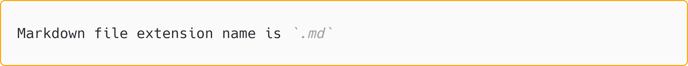
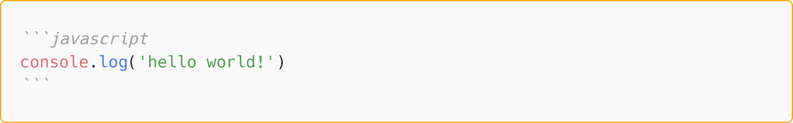
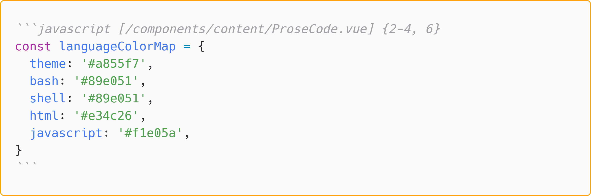

# Write an article

This tutorial will show you how to write an article.

## Editor for Writing

You can choose any [Markdown Editor](https://github.com/mundimark/awesome-markdown-editors) as you like to write the article

::TipBox{type="tip"}
If you already [setup the development environment](./get-start#setup-environment-optional) on your local PC, you can also write article at VS Code.

There are some useful VS Code extensions you can install to help you optimize the user experience when writing markdown files:

* [Markdown Preview Enhanced](https://marketplace.visualstudio.com/items?itemName=shd101wyy.markdown-preview-enhanced)
* [MDC](https://marketplace.visualstudio.com/items?itemName=Nuxt.mdc)
::

## Where to write

::TipBox{type="tldr"}
* Writing articles inside the :file_folder: `/content/article` folder
* Each markdown file is an article, they will auto generate to website pages.
* The :page_facing_up: `/content/index.md` file set the introduction content for Home Page
* The :page_facing_up: `/content/about.md` file set the content for About Page
* Please follow the rules about the name of file and folder name
::

You may get confused because the project contains :dizzy_face: a mess of sub-folders or files. But don't be panic, **most of the time you can just focus the :file_folder: `/content` folder**, which is the container for all article files.

Have a look at the :file_folder: `/content` folder, you can the `*.md` file. Yep, this's article, which written in a special syntax call Markdown.

::TipBox{type="tip"}
You can read the next chapter of this article *[How to write](#how-to-write)* to learn more about it.
::

Firstly you can create two special files inside :file_folder: `/content` folder:

* :page_facing_up: `/content/index.md` this file setting the introduction content of the [Home Page](/)

* :page_facing_up: `/content/about.md` this file setting the content of [About Page](/about)

<!-- You can rewrite the content of these two files :page_facing_up: `/content/index.md` and :page_facing_up: `/content/about.md` to change the relative part of Home Page or About Page. -->

Then you may notice the :file_folder: `/content/article` folder, which contains all articles.

For example this website is also built by BlogiNote, you can check out the project structure in [Github](https://github.com/Benbinbin/BlogiNote), and find out this article inside the [sub-folder](https://github.com/Benbinbin/BlogiNote/tree/main/content/article/tutorial) :file_folder: `/content/article/tutorial`.

<!-- You can delete all the existed articles inside the :file_folder: `/content/article` folder (but please keep the `/content/article` folder), then create a new markdown file inside the :file_folder: `/content/article` folder and start to :pencil: write you own article. -->

::TipBox{type="warning"}
The engine will auto generate websites (and relative URLs) based on the folders structure and the markdown files content.

You must follow some rules about folder and file name to avoid weird situation:

* it's a good idea that the name of folder or file just consists of number and alphabet
* folder or file name should be the lower-case, because the URL is not case-sensitive
* use hyphen `-` to separate word but **not** the space bar, because the URL will convert the space bar to `%20`
::

## How to write
BlogiNote can consume three types of file to generate web page, they are **Markdown** file, **JSON** file and **CSV** file:

* [:IconCustom{name='bi:markdown'} **Markdown file**]{.text-purple-500}

    The file extension name is `.md`. Open a file in this type, you can see plain text with some strange marks, like `###`, which means the level 3 heading. With some simple syntax rules, it can convert the plain text content to rich text content.

    ::TipBox{type="tip"}
    You can also learning Markdown basic syntax from the following two websites:

    * [CommonMark](https://commonmark.org/): this website shows the most basic syntax, like how to mark a header, a link, an image and so on

    * [GitHub Flavored Markdown Spec (GFM)](https://github.github.com/gfm/): this website shows the GFM syntax, which is another Markdown extended syntax created by Github, like supporting the footnote
    ::

* [:IconCustom{name='bi:filetype-json'} **JSON file**]{.text-orange-500}

    The file extension name is `.json`. Open a file in this type, you can see the content like a tree. The data of this file is in a nested hierarchical structure, layer by layer.

* [:IconCustom{name='bi:filetype-csv'} **CSV file**]{.text-green-500}

  The file extension name is `.csv`. Open a file in this type, you can see a lot of Comma, because `CSV` is the abbreviation of Comma-Separated Values. It's one of the most common file type for spreadsheet, you maybe edit many time of these files in Microsoft Excel

### Markdown
Because Markdown provides some useful syntax rules to mark the plain text content, you can easily write a blog post in rich text format, with heading, list, quote and so on.

Most of the time, you will write a blog post in markdown file, BlogiNote support basic Markdown syntax and MarkDown Components extended syntax (also called [MDC](https://content.nuxtjs.org/guide/writing/mdc/) for short).

::TipBox{type="tip"}
除了 Markdown 的基础语法，还需要了解一个相关的概念 Front Matter

它是指位于 markdown 文件的顶部，并用两条 `---`（三横线）包裹的内容，这些内容使用 YAML 语法编写，可以为文章添加一些元信息

[YAML 或 YML](https://yaml.org/) 是一种特殊的语法，它的内容使用一系列的 `key: value` 键值对，例如在本文所对应的 markdown 文件就有一个 `cover: ./images/write.jpg` 键值对用于设置文章的封面。

在 markdown 文件解析生成网页后，这些 metadata 信息并不像显示在网页上，所以不需要担心添加在顶部的 Front Matter 将文章「弄乱」

在另一篇[文章](./setting-cn#front-matter)中总结了 BlogiNote 所使用的一些特殊 Front Matter 属性，通过它们可以配置文章界面和交互行为

Front Matter is a concept related to Markdown, which refers to the content located at the top of a Markdown file and is enclosed by two sets of `---` (three hyphens). This content is written using YAML syntax and allows you to add metadata to hte article.

[YAML or YML](https://yaml.org/) is a special syntax that uses a series of `key: value` pairs. For example, in the Front Matter of the Markdown file corresponding to this page, there is a key-value pair `cover: ./images/write.jpg` used to set the cover image for the article.

After parsing the Markdown file and generating the webpage, these metadata information is not displayed on the webpage, so there is no need to worry about the Front Matter at the top of the file affecting the article's appearance.

In [another article](./setting#front-matter), there is a summary of some special Front Matter properties used in BlogiNote, you can configure the article's interface and interactive behavior by setting them.
::

The following parts will show some details you should pay attention to when writing markdown file:

#### link

The syntax of url link in markdown is `[Google](www.google.com)`, the content inside the square brackets `[]` will show in the page, and the content inside the parentheses `()` is the url.

If you want to link to the page inside your project, you should use the **Relative Link**, which start with `.` and `..`

* the `.` dot at the start of the url path means the **folder** where the current file is located
* the `..` two dots at the start of the url path means the **parent folder** where the current file is located

For example the markdown file `content/article/tutorial/example.md` is inside the :file_folder: `tutorial` folder, if you want to write a link in the `example.md` to the page generated by the markdown file `content/article/tutorial/setting.md`, it should be like `[setting page](./setting)`

::TipBox{type="tip"}
Please notice that the file extension `.md` **don't** need to add to the url path.
::

Another example is adding a link in the `example.md` to the page generated by the markdown file `content/article/setting.md`, it should be like `[setting page](../setting)`


If you want to link to the heading inside the page, you should use the **Anchor Link**, which start with `#`.

For example the markdown file has a heading named `How to Write` and the anchor link should be `[link](#how-to-write)`

::TipBox{type="tip"}
Please notice that all the words are lowercase, and use the hyphen `-` to link them together.
::

You can also combine these two special types of link together to write a link which point to particular heading of another page, like `[link](./setting#front-matter)`


#### Code
::TipBox{type="announce"}
Firstly, you should know the concept of **highlight theme** and the **preload program languages**.

**Highlight theme** is a color rules to decorate the code text based on the program language.

**Preload program languages** is a list of program languages, which are selected for the highlight engine, and the server will do some work under the hook, to make sure the block code content highlighted correctly.

These two concept should be set inside the :page_facing_up: `nuxt.config.ts` file.

You can read the *[Choose your code highlight Theme](./faq#choose-your-code-highlight-Theme)* and *[Add some preload program languages](./faq#add-some-preload-program-languages)* these two part of the [FAQ](./faq) article.
::

Markdown support two types of code:

* inline code: the code inside the paragraph, writing inline code between the **backquote**

    ::TabGroup
        ::TabItem{name="Markdown"}
        
        ::

        ::TabItem{name="Result"}
        Markdown file extension name is `.md`
        ::
    ::

    ::TipBox{type="tip"}
    Usually the backquote key is under `Esc` key in your keyboard
    ::

* block code: the code show as a block, writing block code between **three backquote**

    ::TabGroup
        ::TabItem{name="Markdown"}
        
        ::

        ::TabItem{name="Result"}
        ```javascript
        console.log('hello world!')
        ```
        ::
    ::

    ::TipBox{type="warning"}
    In order to highlight the code correctly, you **must** specify which program language the block code belongs to right after the three backquote

    The block code highlight engine is Shiki, which supports a hundreds of program languages.

    But to be more accurate, you should check out [this page](https://github.com/shikijs/shiki/blob/main/docs/languages.md) first, and make sure that Shiki support the program language your block code belongs to.

    If the program language isn't supported, or you don't know which program language the block code belong to, **you can assign to the `md` or `markdown`** as a fallback solution.
    ::

    you can also provide more information about your code block:

    * **add the file name** inside the square brackets, like `[filename]`, to specify where the code come from

        ::TipBox{type="tip"}
        you can also add a link to specify the source of the code block, the link should start with `https`, `http` or `www`
        ::

    * **highlight some lines** of your code block by adding some number inside the curly brackets, like `{2-4, 6}` to highlight the lines from second to fourth, and the sixth line

    ::TabGroup
        ::TabItem{name="Markdown"}
        
        ::

        ::TabItem{name="Result"}
        ```javascript [/components/content/ProseCode.vue] {2-4, 6}
        const languageColorMap = {
        theme: '#a855f7',
        bash: '#89e051',
        shell: '#89e051',
        html: '#e34c26',
        javascript: '#f1e05a',
        }
        ```
        ::
    ::

#### MDC
MDC stand for MarkDown Components extended syntax, it expand the edge of the ability of Markdown by embedding the Vue components.

You can check out another tutorial ***[MDC](./mdc)*** to learn more about the build-in MDC provided by BlogiNote.

## Set title
There are many ways to set the article title:

* the markdown file name

* the level 1 heading (which is only with one `#` hashtag) in the article (and it should be the first element in the article)

* setting the `title` property at Front Matter

the priority level is `title` property > the level 1 heading > file name

::TipBox{type="tip"}
The introduction to Front Matter can be found in [the previous section](#markdown).
::

Most of the time you only need to write a level 1 heading at the begin of the article (if your article has some Front Matter content, the level 1 heading should be follow the Front Matter).

If you don't want to write the level 1 heading at the top of the article, and you don't like the file name as the article title, you can provide the `title` property at Front Matter to rewrite the title of the article.

::TipBox{type="warning"}
Please don't provide the `title` property and the level 1 heading at the same time, because the level 1 heading will always be hidden, and only show the `title` property as the article title in web page.
::

::TipBox{type="announce"}
the url of the article is always based on the file system path and the file name (rather than the article title).
::

## Add a cover
use the Front Matter property `cover: image_file_path` to set a cover image for the article

::TipBox{type="tip"}
The introduction to Front Matter can be found in [the previous section](#markdown).
::

The image will be shown at the top of the article and the right corner of home page article list item.

You can use the local image or remote image as the cover:

* If you want to link the local image file as the cover, you should use the **relative path** which starts with a dot `.`

    1. Download the image first

        For example I download an [image](https://unsplash.com/photos/xG8IQMqMITM) (Photo by [Aaron Burden](https://unsplash.com/@aaronburden) on [Unsplash](https://unsplash.com/)), and rename the file name as `write.jpg`

    2. Then put it into the project.

        For example I put the image into the folder :file_folder: `/content/article/tutorial/images` which is close to the markdown article file `/content/article/tutorial/write-article.md`

    3. now the image **relative path** for markdown article is `./images/write.jpg` so add `cover: ./images/write.jpg` at the top of this article within `---` three dashes

        ::TipBox{type="tip"}
        starts dot `.` of the **relative path** means the folder current file belong to.

        In this example, the current file is the :page_facing_up: `write-article.md` file, so the `.` is the the alias of :file_folder: `tutorial` folder
        ::

* If you want to link the remote image file as the cover, just need to use the url as the the image path

    For example I want to use this [image](https://i.picsum.photos/id/0/5616/3744.jpg?hmac=3GAAioiQziMGEtLbfrdbcoenXoWAW-zlyEAMkfEdBzQ) as the cover, which url is `https://i.picsum.photos/id/0/5616/3744.jpg?hmac=3GAAioiQziMGEtLbfrdbcoenXoWAW-zlyEAMkfEdBzQ`

    So I just need to add `cover: https://i.picsum.photos/id/0/5616/3744.jpg?hmac=3GAAioiQziMGEtLbfrdbcoenXoWAW-zlyEAMkfEdBzQ` at the top of this article within `---` three dashes

## Article Categorization
You have the option to add tags or specify a series for the articles. These tags or series will be displayed below the title on the article page, and they can be interacted.

For instance, if you assign a series to an article, a button with the series name will appear below the article title. Clicking on this button will open a window listing all the articles belonging to that series.

Furthermore, on the article list page at `https://your.domain.com/list`, you can quickly sort and retrieve articles based on tags and series.

### tags
Set the `tags` property in the Front Matter to add tags to the article. Its value should be an array, so multiple tags can be added to an article.

In YAML syntax, if a property's value is an array, it needs to be listed on a separate line. Each element should be indented (with at least two spaces at the beginning of the line) and preceded by a hyphen `-` as a marker, with a space between the marker and the specific value.

::TipBox{type="tip"}
The introduction to Front Matter can be found in [the previous section](#markdown).
::

For example, to add the tags "note" and "blog", you would set the Front Matter at the top of the article as follows:

```md
---
tags:
  - note
  - blog
---
```

### series
Set the `series` property in the Front Matter to specify the series to which the article belongs to.

You can also set the `seriesOrder` attribute in the Front Matter to determine the article's order in the series.

::TipBox{type="tip"}
The introduction to Front Matter can be found in [the previous section](#markdown).
::

For example, to assign the article to the series `tutorial for BlogiNote` and set its order as `2`, you would add the following to the Front Matter at the top of the article:

```md
---
series: tutorial for BlogiNote
seriesOrder: 2
---
```

## Related articles
You can set two related articles for the current article, which will be displayed at the top and bottom of the article page. Clicking on the respective buttons will navigate to the related articles.

* Set the `nextArticleName` and `nextArticleUrl` attributes in the Front Matter to specify the **name** and **file path** (using relative paths, ignoring the file extension `.md`) of the next article.

* Set the `prevArticleName` and `prevArticleUrl` attributes in the Front Matter to specify the **name** and **file path** (using relative paths, ignoring the file extension `.md`) of the previous article.

::TipBox{type="tip"}
The introduction to Front Matter can be found in [the previous section](#markdown).
::

For example, to specify the previous article with the name `introduction` and the markdown file path `introduction.md`

As the absolute path of the current article is `root/content/article/tutorial/write-article.md` and the absolute path of the previous article is `root/content/article/introduction.md`, the relative path of the previous article (with respect to the current article) is `../introduction`

you would set the following in the Front Matter at the top of the article:

```md
---
prevArticleName: introduction
prevArticleUrl: ../introduction
---
```

::TipBox{type="announce"}
For articles has set a series which its belongs to, the program will automatically set the previous and next article based on the order of the articles in the series.

You can also manually set the Front Matter properties which mentioned earlier for the current article to override the automatically generated related articles.
::

## Set time
Set the `created` or `updated` properties in the Front Matter to specify the creation and update time of the article, respectively. The time format should be `YYYY-MM-DD`, for example, `2023-02-01`.

Set the `showTime` property in the Front Matter with a value of `true` or `false` to indicate whether to display the timestamp on the article page.

You can also set the `showOutdatedWarning` property in the Front Matter with a value of `true` or `false` to enable or disable the expiration warning for the article, to alert users about the timeliness of the content.

::TipBox{type="tip"}
The default threshold for an article to be considered "expired" is `30` days, but you can modify this in the project configuration file `app.config.ts`

For information on configuring the project using the `app.config.ts` file, you can refer to [this article](./setting#app-config).
::

::TipBox{type="tip"}
The introduction to Front Matter can be found in [the previous section](#markdown).
::